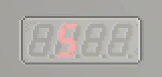

# SegmentDisplay


## Properties 

### States - `{{boolean}}`
A table that maps the lit/unlit state of all the Leds in the display.

Each segment can be accessed in the table starting from the top of the display to the period in the display in a clockwise fashion as shown in the image below.


<!-- So if you wanted to display 2 for example, you would need to turn on 1, 2, 4, 5, and 7.

 -->

### Colors - `{{color}}`
A table that maps the color of all the Leds in the display.


## Methods

### ShowDigit(groupIndex `number`, digit `number`)
Show a digit automatically. Can only display 0-9, and **will not automatically write larger numbers.**

`groupIndex` is used on larger SegmentDisplays to determine which digit to write to, starting at 1 from the left.

```lua
gdt.SegmentDisplay0:ShowDigit(2,5)
```


### SetDigitColor(groupIndex `number`, color `color`)
Like `ShowDigit`, but will set the color for all segments responsible for a digit.